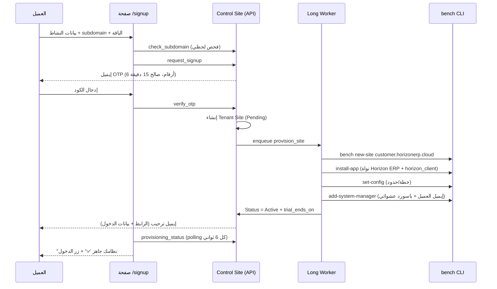

# Frappe Bench → SaaS: التصور المعماري الكامل + البروتوتايب
### Horizon Smart Systems — بواجهة الوكيل الذكي «الاء»

**الهوية المطبّقة في صفحة التسجيل والإيميلات:** كحلي `#1D2D44` (أساسي) · أزرق `#5083BC` (حصريًا لتأكيد النجاح — "نظامك جاهز ✅" وتوقيع الاء) · رمادي فاتح `#DFE0DB` · شبه أسود `#221f1f` · خط Cairo · وضع فاتح إجباري (`color-scheme: light`) · عناصر الموبايل متمركزة (mobile-centered). كل رسائل النظام (OTP، ترحيب، تنبيهات 7/3/1، إيقاف، إعادة تفعيل) موقّعة باسم **الاء | Horizon Smart Systems**.

**النموذج:** Site-per-Tenant على bench واحد (نفس نموذج Frappe Cloud) — كل عميل يحصل على موقع Frappe مستقل بقاعدة بيانات MariaDB منفصلة تمامًا، على subdomain خاص به.

```
customer1.horizonerp.cloud  ──┐
customer2.horizonerp.cloud  ──┤──►  nginx (wildcard) ──► frappe-bench (سيرفر واحد)
customer3.horizonerp.cloud  ──┘         │
                                       ├─ site: control.horizonerp.cloud  ← تطبيق saas_manager (لوحة التحكم)
                                       ├─ site: customer1.horizonerp.cloud (DB منفصلة)
                                       ├─ site: customer2.horizonerp.cloud (DB منفصلة)
                                       └─ ...
```

---

## 1) المكونات الخمسة

| المكوّن | الدور | التنفيذ |
|---|---|---|
| **Control Site** | موقع Frappe مركزي عليه تطبيق `saas_manager` | `control.horizonerp.cloud` |
| **صفحة التسجيل** | فورم عام (Guest) بثلاث خطوات: بيانات → OTP → تجهيز | `/signup` على الـ Control Site |
| **Provisioner** | Worker على طابور `long` ينفذ أوامر `bench` بشكل آمن | `provisioner.py` عبر subprocess (arg lists — لا shell) |
| **Lifecycle Engine** | Scheduler يومي: إنذارات 7/3/1 يوم، إيقاف تلقائي بعد Grace، نسخ احتياطي ليلي | `lifecycle.py` + hooks scheduler_events |
| **البنية التحتية** | Wildcard DNS + Wildcard SSL + nginx DNS multitenancy | Cloudflare + certbot dns-01 |

---

## 2) رحلة العميل الآلية بالكامل (Zero-Touch)



**زمن التجهيز المتوقع:** 2–5 دقائق (new-site + تركيب Horizon AI Powered ERP).

---

## 3) دورة الاشتراك (تتوافق مع نموذج التحويل البنكي + التفعيل اليدوي)

```
Trial (14 يوم) ──► إنذارات قبل الانتهاء بـ 7/3/1 يوم (إيميل تلقائي)
      │
      ├─ العميل حوّل بنكيًا ──► الأدمن يضغط "Activate/Extend" من Desk ──► تمديد subscription_ends_on
      │                          (لاحقًا: webhook دفع إلكتروني ينادي lifecycle.activate تلقائيًا)
      │
      └─ لم يدفع ──► Grace 3 أيام ──► إيقاف تلقائي (maintenance_mode=1 + pause_scheduler=1)
                                          │
                                          ├─ دفع ──► Resume فوري (زرار واحد)
                                          └─ 60 يوم Suspended ──► drop يدوي فقط (باك أب نهائي أولًا)
```

قواعد مهمة مطبّقة في الكود:
- **الإيقاف لا يمسح أي بيانات** — maintenance mode فقط، والبيانات كاملة تعود بضغطة Resume.
- **الحذف يدوي حصريًا** (`drop_site`) — غير موصول بأي scheduler، ويرفض التنفيذ قبل باك أب نهائي و60 يوم إيقاف.
- التمديد يبني على تاريخ الانتهاء الحالي (لو لسه ساري) وليس تاريخ اليوم — العميل لا يخسر أيامًا.

---

## 4) الأمان (أهم جزء في المعمارية)

1. **حقن الأوامر مستحيل:** كل أوامر bench تُنفذ كـ argument list (`subprocess.run([...])`) — لا `shell=True` ولا string interpolation أبدًا.
2. **Subdomain regex صارم قبل أي أمر:** `^[a-z][a-z0-9-]{2,30}$` + قائمة أسماء محجوزة (www, admin, api…).
3. **OTP مخزّن كـ SHA-256 hash** — لا يوجد كود صريح في قاعدة البيانات، مع حد 5 محاولات وصلاحية 15 دقيقة.
4. **Rate limiting** على IP: 10 تسجيلات/ساعة، 20 محاولة OTP/ساعة.
5. **كلمة سر root للداتابيز** في `site_config.json` للـ Control Site فقط (`saas_db_root_password`) — لا تظهر في اللوجات (يتم إخفاء أي flag فيه "password" تلقائيًا في provisioning_log).
6. **باسوردات عشوائية** (secrets module) للأدمن والمالك، والعميل يُطالب بتغييرها فور أول دخول.

---

## 5) تجهيز البنية التحتية (مرة واحدة)

```bash
# 1) DNS: سجل wildcard في Cloudflare
#    *.horizonerp.cloud  A  →  IP السيرفر
#    control.horizonerp.cloud  A  →  IP السيرفر

# 2) تفعيل DNS multitenancy على الـ bench
bench config dns_multitenant on

# 3) Wildcard SSL (certbot dns-01 عبر Cloudflare API)
sudo apt install certbot python3-certbot-dns-cloudflare
sudo certbot certonly --dns-cloudflare \
  --dns-cloudflare-credentials /etc/letsencrypt/cloudflare.ini \
  -d "*.horizonerp.cloud" -d "horizonerp.cloud"
# ثم اربط الشهادة في nginx template أو custom nginx conf

# 4) إنشاء الـ Control Site وتركيب التطبيق
bench new-site control.horizonerp.cloud --admin-password '...'
bench get-app /path/to/saas_manager   # أو من git repo
bench --site control.horizonerp.cloud install-app saas_manager

# 5) إعدادات الـ Control Site
bench --site control.horizonerp.cloud set-config saas_root_domain "horizonerp.cloud"
bench --site control.horizonerp.cloud set-config saas_bench_dir "/home/frappe/frappe-bench"
bench --site control.horizonerp.cloud set-config saas_db_root_password "********"

# 6) SMTP على الـ Control Site (Email Account) — ضروري لإرسال OTP والترحيب

# 7) تأكد من وجود long workers في supervisor/Procfile (bench worker --queue long)

# 8) nginx بعد أي موقع جديد لا يحتاج regenerate لأن dns_multitenant
#    يخدم كل المواقع من نفس الـ server block عبر wildcard — تأكد أن
#    server_name يشمل *.horizonerp.cloud (bench setup nginx ثم راجع الملف)
```

**نقطة تحقق إلزامية قبل التشغيل** (حسب قاعدة CLAUDE.md بتاعتك):
شغّل `bench new-site --help` و `bench add-system-manager --help` على السيرفر الفعلي وتأكد من أسماء الـ flags — الكود مكتوب لـ v15 (`--db-root-password`)، وفي v14 الاسم `--mariadb-root-password`. الثابت `DB_ROOT_FLAG` في أول `provisioner.py` معمول مخصوص عشان تغيّره في سطر واحد.

---

## 6) هيكل البروتوتايب

```
saas_manager/
├── hooks.py                      # scheduler_events + after_install
├── install.py                    # إنشاء باقات Horizon Basic/Pro/Enterprise تلقائيًا (أسعار قابلة للتعديل)
├── api/signup.py                 # 5 endpoints عامة: plans, check_subdomain,
│                                 #   request_signup, verify_otp, provisioning_status
├── provisioning/
│   ├── provisioner.py            # provision_site (new-site → install → user → activate)
│   └── lifecycle.py              # activate/suspend/resume/backup/drop + scheduler jobs
├── doctype/
│   ├── saas_plan/                # الباقة: سعر، حدود، تطبيقات، أيام التجربة
│   ├── signup_request/           # طلب التسجيل + OTP hash + محاولات
│   └── tenant_site/              # الموقع: الحالة، التواريخ، اللوج، أزرار Desk
└── www/signup/                   # صفحة التسجيل (RTL، هوية هورايزون، 3 خطوات)
```

أزرار Desk الجاهزة على Tenant Site: **Provision Now** (للفاشل/المعلّق)، **Activate/Extend** (بعد التحويل البنكي — يسأل عن عدد الشهور)، **Suspend / Resume / Backup Now**.

---

## 7) لماذا ليس frappe/press؟

| | **saas_manager (هذا الكيت)** | **frappe/press (محرك Frappe Cloud)** |
|---|---|---|
| التعقيد | تطبيق واحد، يوم تركيب | منظومة كاملة: agent + proxy + billing + multi-server |
| مناسب لـ | حتى ~100–200 موقع على bench واحد/اثنين | مئات/آلاف المواقع، فرق تشغيل |
| الدفع | تحويل بنكي + تفعيل يدوي (نموذجك الحالي) | Stripe مدمج |
| التوصية | **ابدأ به الآن** | انتقل إليه أو استلهم منه عند التوسع |

## 8) خارطة التوسع (بعد نجاح المرحلة الأولى)

1. **فصل قاعدة البيانات** على سيرفر MariaDB مستقل (أول عنق زجاجة).
2. **Multi-bench:** أضف حقل `bench_host` في Tenant Site + agent صغير (FastAPI) على كل سيرفر ينفذ أوامر bench، والـ Control Site يوزع المواقع الجديدة (round-robin أو حسب المنطقة: bench-egypt / bench-ksa).
3. **S3 backups:** أضف rclone sync في نهاية `backup_site` (مكانه معلّم بتعليق).
4. **Webhook دفع** (Paymob/فوري/Tap): ينادي `lifecycle.activate` مباشرة — التفعيل اليدوي يبقى fallback.
5. **تطبيق client خفيف** يُركّب على مواقع العملاء لفرض حد المستخدمين (`saas_max_users` موجودة بالفعل في site_config كل موقع) وإظهار بانر "باقتك تنتهي خلال X يوم" داخل النظام نفسه.
6. **دمج الوكيل الذكي الاء:** endpoint في saas_manager يقرأ حالة الاشتراك ليعرضها الاء للعميل داخل النظام — الاء بالفعل توقّع كل رسائل OTP والترحيب والتجديد والإيقاف في هذا الكيت، والخطوة التالية إتاحة محادثة معها من داخل موقع العميل.
